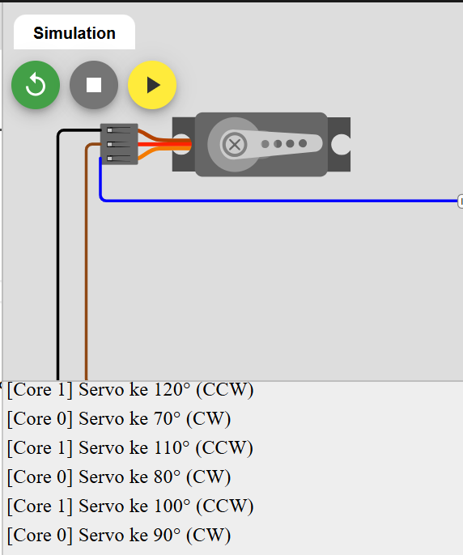
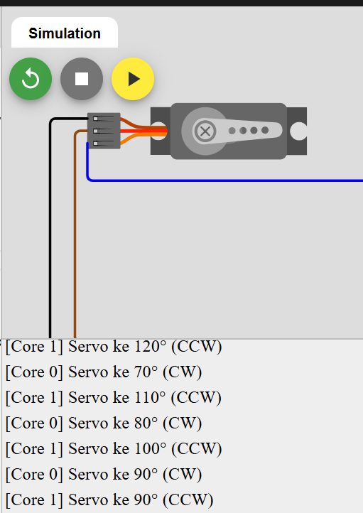

Dual Core Rotary Encoder

📌 Deskripsi  
Percobaan ini menggunakan ESP32-S3 dual-core untuk membaca rotary encoder dan push button secara paralel menggunakan FreeRTOS.
| Core   | Task        | Fungsi                            |
| ------ | ----------- | --------------------------------- |
| Core 0 | TaskEncoder | Membaca rotary encoder (CLK & DT) |
| Core 1 | TaskButton  | Membaca tombol push (SW encoder)  |

🛠️ Hardware Setup
| Komponen           | Pin ESP32-S3 | Mode          |
| ------------------ | ------------ | ------------- |
| Rotary Encoder CLK | GPIO 2       | Input Pull-Up |
| Rotary Encoder DT  | GPIO 14      | Input Pull-Up |
| Rotary Encoder SW  | GPIO 4       | Input Pull-Up |
| Power              | 3.3V & GND   | —             |

📎 Koneksi Encoder
| Encoder Pin | Fungsi      | ESP32-S3 Pin |
| ----------- | ----------- | ------------ |
| CLK         | Channel A   | GPIO 2       |
| DT          | Channel B   | GPIO 14      |
| SW          | Push Button | GPIO 4       |
| +           | VCC         | 3.3V         |
| GND         | Ground      | GND          |

🧠 Cara Kerja Sistem  
Core 0 membaca sinyal rotary encoder menggunakan metode full quadrature:  
- Putar CW → nilai meningkat  
- Putar CCW → nilai menurun  
Core 1 memonitor tombol push (SW encoder): Tekan tombol → menampilkan nilai encoder di Serial Monitor   
Setiap perubahan ditampilkan di Serial Monitor secara realtime.  

▶️ Langkah Percobaan  
| No | Langkah              | Hasil yang Diharapkan             |
| -: | -------------------- | --------------------------------- |
|  1 | Upload program       | Serial tampilkan pesan task start |
|  2 | Putar encoder CW/CCW | Nilai bertambah / berkurang       |
|  3 | Tekan tombol         | Nilai ditampilkan oleh Core 0 & 1 |
|  4 | Buka Serial Monitor  | Terlihat output dari kedua core   |

🎥 Video Demo

Core 0  
  

Core 1  
  
